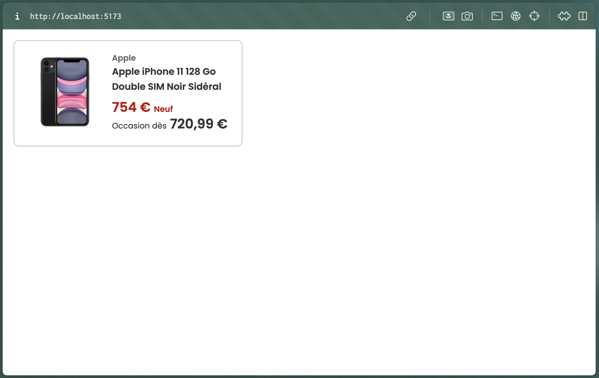

# Rakuten-Frontend-Test

A React implementation of a product card component, created as part of the Rakuten Frontend Technical Test.



## Getting Started

### Prerequisites

- Node.js (>= 14.x)
- npm or yarn

### Installation

1. Clone the repository:

```bash
git clone https://github.com/Neoxs/rakuten-frontend-test.git
```

2. Navigate to the project directory:

```bash
cd rakuten-frontend-test
```

3. Install dependencies:

```bash
npm install
# or
yarn install
```

### Running the Application

1. Start the development server:

```bash
npm run dev
# or
yarn run dev
```

2. Open your browser and navigate to `http://localhost:5173/`

## Implementation

### Project Structure

```
src/
├── components/
│   ├── Price.tsx
│   ├── ProductCard.tsx
│   └── ProductCard.test.tsx
├── types/
│   └── product.ts
└── styles/
    ├── _base.scss
    ├── _variables.scss
    ├── _components.scss
    └── main.scss
```

### Technologies Used

- React with TypeScript
- SCSS for styling
- Jest & React Testing Library

### Key Features Implemented

1. **TypeScript Integration**

   - Defined interfaces for props and data types
   - Strict type checking for component props
   - Type-safe event handling

2. **Responsive Design**

   - Mobile-first approach
   - Responsive typography using rem units
   - Breakpoints for different screen sizes

3. **Component Architecture**

   - Separation of concerns
   - Reusable Price component
   - Props validation
   - Null checking for data

4. **Styling Solution**

   - SCSS variables for consistency
   - BEM methodology for class naming
   - Responsive mixins
   - Maintained provided design specs:
     - Colors: #333, #696969, #BF0000
     - Font sizes: 12px, 14px, 20px

5. **Testing**
   - Jest configuration (Due to time limit still facing some errors)
   - Component rendering tests
   - User interaction tests
   - Null state handling tests

## Bonus Points Achieved

- ✅ TypeScript implementation
- ✅ Responsive design
- ✅ Null state handling
- ✅ Component testing
